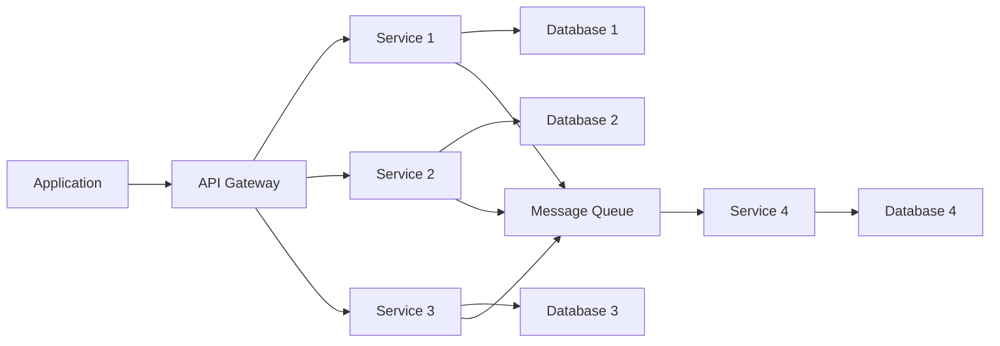

---
tags:
  - practices
  - practices_architecture
title: Microservices
layout: default.njk
---

## Principles

Microservice architecture is an architectural style that structures an application as a collection of small, loosely coupled, and independently deployable services. Each service is responsible for a specific business capability and communicates with other services through lightweight mechanisms such as APIs. Microservice architecture aims to promote scalability, flexibility, and maintainability of complex applications.

## Relationship with DevOps

### Advantages

- Scalability: Microservices can be independently scaled based on the specific service's requirements, allowing for better resource utilization and efficient handling of varying workloads.
- Independent deployment: Each microservice can be deployed independently, enabling teams to release and update services without affecting the entire application. This provides agility, faster time to market, and the ability to adopt continuous deployment practices.
- Flexibility and technology diversity: Microservices allow teams to use different technologies and frameworks for different services based on their specific requirements. This flexibility promotes innovation, technology diversity, and the ability to choose the best tools for each service.
- Fault isolation: If a microservice fails or experiences issues, it doesn't necessarily impact the entire application. Fault isolation enables better resilience and fault tolerance, as failures are contained within a specific service and don't propagate to other parts of the application.

### Disadvantages

- Distributed complexity: Microservice architecture introduces distributed systems complexity, as multiple services need to communicate and handle potential network issues. This complexity includes challenges in managing data consistency, network latency, and inter-service communication.
- Operational overhead: Managing and monitoring multiple services can introduce additional operational overhead. Ensuring service availability, coordinating deployments, and managing communication between services require robust infrastructure and operational practices.
- Service coordination: As services evolve and interact with each other, it becomes necessary to manage service coordination and version compatibility. Changes in one service may require corresponding changes in other services, which can add complexity to the development and deployment process.
- Testing and debugging: Testing and debugging can become more challenging in a distributed microservice environment. Coordinating tests, simulating real-world scenarios, and debugging issues across services can be complex and time-consuming.
