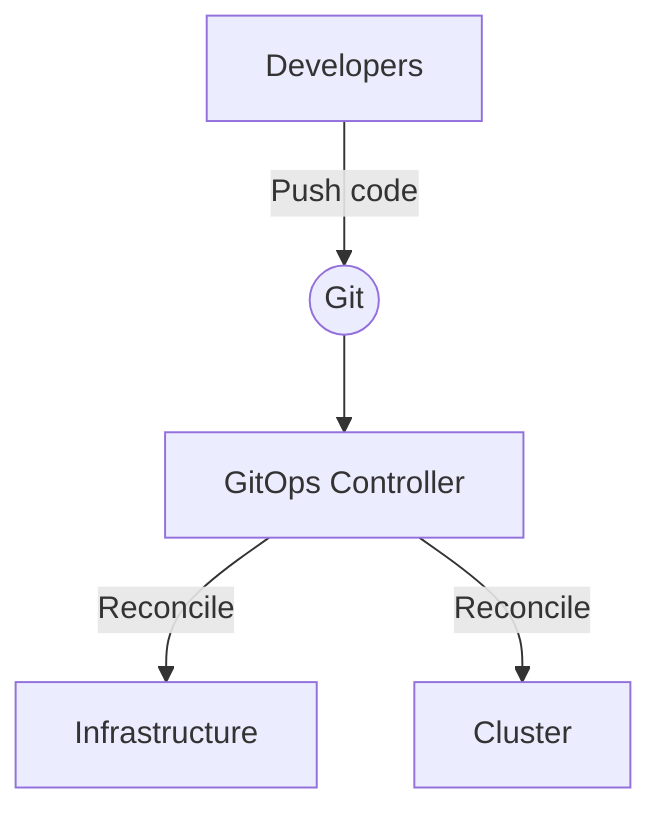

---
tags:
  - practices
  - practices_cicd
title: GitOps
layout: default.njk
---

## Relationship with DevOps

### Advantages

- Simplified Operations: GitOps centralizes configuration management and deployment pipelines, making it easier to manage and automate infrastructure and application deployments.
- Version Control: GitOps leverages Git's version control capabilities, enabling teams to track changes, roll back to previous versions, and review and collaborate on configuration changes effectively.
- Consistency and Reproducibility: By defining infrastructure and application configurations as code stored in Git repositories, GitOps ensures consistent and reproducible deployments across environments.
- Traceability and Auditing: GitOps provides a clear audit trail of all changes made to the infrastructure and application configurations, making it easier to track who made changes and when.
- Immutable Infrastructure: GitOps promotes the use of immutable infrastructure, where infrastructure and application changes are made by deploying new versions instead of modifying existing resources. This approach improves reliability and simplifies rollbacks.
- Continuous Delivery: GitOps enables continuous delivery practices by automatically applying changes to the infrastructure and applications whenever there are updates pushed to the Git repository, reducing manual intervention and enabling faster delivery cycles.
- Collaboration and Visibility: GitOps allows multiple team members to collaborate on configuration changes using familiar Git workflows, facilitating better communication and visibility into the deployment process.

### Disadvantages

- Learning Curve: Adopting GitOps requires a learning curve, particularly for teams not familiar with Git or version control systems. Training and onboarding may be necessary to ensure all team members understand and use GitOps effectively.
- Dependency on Git: GitOps heavily relies on Git as the central source of truth for configuration management. If there are issues with the Git repository or its availability, it can impact the deployment process.
- Complex Configurations: For complex infrastructure or application configurations, managing everything through Git repositories may become challenging. Careful design and organization of repositories and configurations are necessary to maintain manageability.
- Potential Security Risks: Storing infrastructure and application configurations in Git repositories poses security risks if proper access controls and security measures are not implemented. Safeguarding the repositories and managing secrets is crucial to prevent unauthorized access.
- Limited Offline Capabilities: GitOps assumes continuous connectivity to the Git repository to fetch and apply changes. In scenarios where network connectivity is limited or intermittent, it may hinder the deployment process.
- Potential Overhead: While GitOps streamlines operations, it may introduce additional overhead in terms of managing and maintaining the GitOps pipeline, ensuring proper synchronization between Git and the infrastructure, and monitoring deployments.

### Advantages
