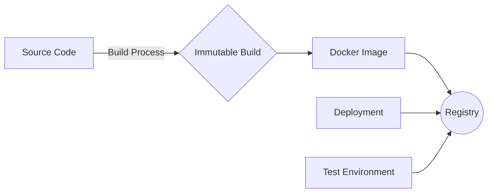

---
tags:
  - practices
  - practices_cicd
title: Immutable Builds
layout: default.njk
---

Work in progress...

## Relationship with DevOps

Advantages

- Consistent and Reproducible: Immutable build ensures that each build produces a consistent and reproducible artifact, such as a Docker image. The build process is deterministic, eliminating variations caused by the build environment.
- Improved Quality Assurance: Immutable builds enable thorough testing and validation of the build artifact in a controlled environment before deployment. This helps identify issues early and ensures a higher-quality final product.
- Security and Compliance: Immutable builds provide a secure and auditable process by capturing a snapshot of the build artifact at a specific point in time. This makes it easier to verify the integrity of the build and satisfy compliance requirements.
- Rapid Deployment: Immutable builds simplify the deployment process by packaging the application or service into a self-contained artifact. This allows for quick and reliable deployment across different environments, reducing the time between development and production deployment.
- Scalability and Rollbacks: Immutable builds facilitate scalability by enabling the deployment of multiple instances of the same artifact. Additionally, if an issue occurs in a deployed version, rollbacks are straightforward by reverting to a previous immutable build.
- Isolation and Dependency Management: Immutable builds encapsulate dependencies within the artifact, reducing conflicts and dependency-related issues. This ensures that the build remains self-contained and doesn't rely on external dependencies for its proper functioning.
- Efficient CI/CD Pipelines: Immutable builds streamline continuous integration and continuous deployment (CI/CD) pipelines by reducing the complexity of managing incremental changes. Each build produces a distinct and independent artifact, enabling parallel processing and efficient deployment pipelines.

Disadvantages

- Increased Build Time: Immutable builds require rebuilding the entire artifact from scratch, which can increase the build time compared to incremental builds. This can be a concern in large projects or when frequent builds are necessary.
- Storage Overhead: Immutable builds generate separate artifacts for each build, potentially consuming more storage space compared to incremental builds. Careful management of artifacts and appropriate storage solutions are required to mitigate this issue.
- Complexity for In-Place Updates: If an application or service requires in-place updates instead of a complete replacement, managing immutable builds can be more challenging. Additional strategies, such as blue-green deployments or canary releases, may be necessary to handle these scenarios effectively.
- Learning Curve and Tooling: Adopting immutable builds may require a learning curve for the development team, particularly when implementing new build processes and leveraging containerization technologies. Familiarity with tools and practices such as Docker, container registries, and orchestration platforms is necessary.
