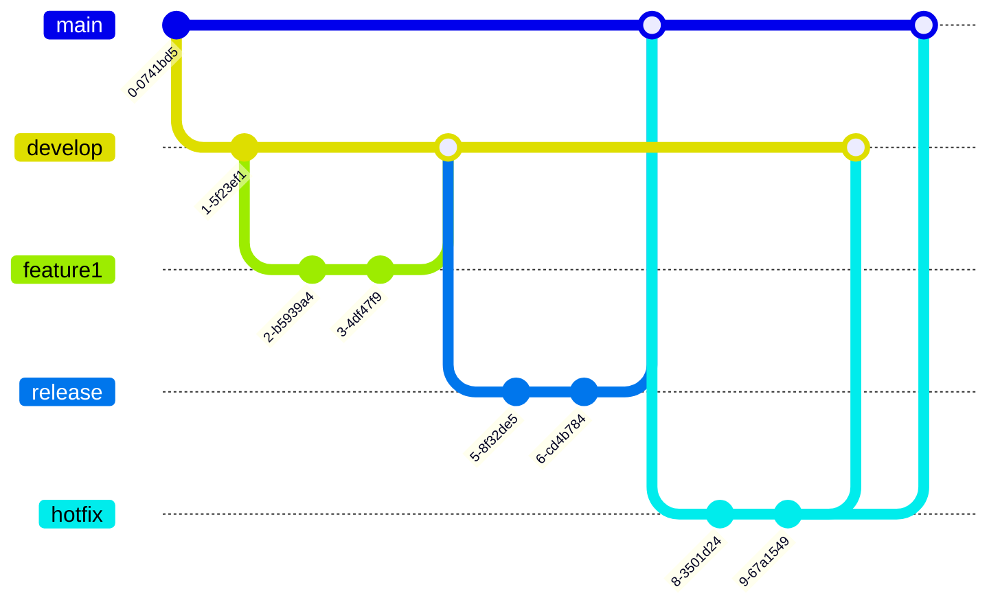

---
tags:
  - practices
  - practices_scm
title: GitFlow
layout: default.njk
---

## Principles

Gitflow is a branching model for version control in software development using Git. It provides a structure and a set of guidelines for managing branches and releases throughout the development process. Gitflow uses two main branches, "master" and "develop," along with supporting branches to facilitate parallel development and the release of features.

## Relationship with DevOps

### Advantages

- Clear structure: Gitflow provides a clear and organized workflow, making it easier to manage parallel development and releases.
- Separation of features and releases: The model separates feature development from release stabilization, allowing for a more controlled and stable release process.
- Easy collaboration: Gitflow facilitates collaboration among team members by providing a consistent branching model that everyone can follow.
- Version control: With Gitflow, it's easier to track and manage different versions of the codebase, as each release is represented by a separate branch.

### Disadvantages

- Complexity: Gitflow introduces additional branches and rules, which can be complex for newcomers or small teams that don't require such a structured workflow.
- Overhead: Maintaining multiple branches and merging them can introduce overhead and potentially lead to conflicts, especially when dealing with a large codebase or frequent releases.
- Slower releases: The release process in Gitflow involves several steps, including creating a release branch, testing, and merging, which can slow down the release cycle compared to more streamlined approaches like continuous integration/continuous deployment (CI/CD).
- Limited flexibility: Gitflow assumes a certain workflow and may not be suitable for all types of projects or development methodologies. It may not adapt well to agile or rapidly changing development environments.

## Related DevOps Articles

## Reference
