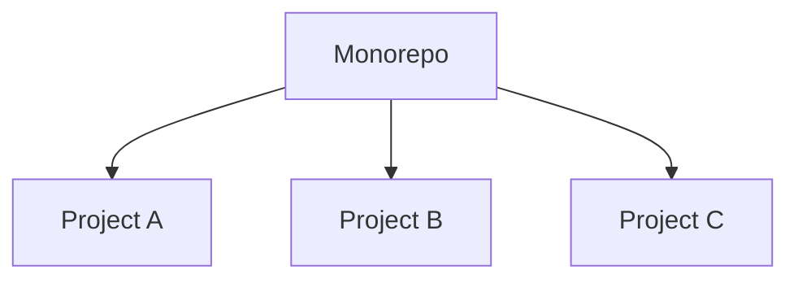

---
tags:
  - practices
  - practices_scm
title: Monorepo
layout: default.njk
---

## Principles

A monorepo is a version control repository that contains multiple projects, components, or services within a single codebase. It consolidates the code for all related software entities, allowing for shared code, dependencies, and tooling across different projects or components.

## Relationship with DevOps

Trunk-Based Development is relavant to DevOps because it focuses on enhancing continuous integration.

### Advantages

- Code Sharing and Reusability: Monorepos enable code sharing and reusability across projects. Common code, libraries, and utilities can be easily shared and maintained, reducing duplication and improving code consistency.
- Simplified Dependency Management: With a monorepo, managing dependencies becomes easier as all projects share the same dependency tree. This reduces conflicts, simplifies updates, and ensures compatibility between different components.
- Simplified Build and Testing: Building and testing multiple projects within a monorepo is more streamlined. Changes across projects can be tested together, allowing for better integration testing and more efficient continuous integration pipelines.
- Cross-Project Refactoring: When refactoring or making changes that affect multiple projects, a monorepo allows for seamless coordination and refactoring across projects. This ensures consistency and simplifies the refactoring process.
- Ease of Collaboration: Monorepos foster collaboration by providing a single point of reference for the entire codebase. Developers can easily navigate and understand the overall system, share knowledge, and work together on different projects.
- Uniform Tooling and Standards: A monorepo allows for consistent tooling and coding standards across projects. Developers can enforce and apply consistent practices, linting rules, and code formatting conventions, ensuring a unified development experience.
- Simplified Release Management: With all projects in a single repository, coordinating releases becomes more straightforward. Versioning and release management can be centralized, ensuring consistency and facilitating coordinated deployments.

### Disadvantages

- Increased Repository Complexity: As the codebase grows, the monorepo can become large and complex, making it challenging to navigate and maintain. Proper organization, modularization, and documentation are necessary to mitigate this issue.
- Increased Repository Cloning Time: Cloning a monorepo can take longer than cloning individual repositories, especially if the codebase is substantial. This can impact new team members' onboarding time or when setting up development environments.
- Limited Decentralization: Monorepos may limit the autonomy and decentralization of teams working on different projects. Conflicts and coordination issues can arise when multiple teams need to make changes or releases simultaneously.
- Dependency Coupling: While shared dependencies can simplify development, they can also introduce tight coupling between projects within the monorepo. Careful management and separation of concerns are necessary to avoid unintended consequences.
- Increased Risk of Merge Conflicts: With multiple projects in a single repository, the likelihood of merge conflicts can increase,

## Related DevOps Articles

## Reference
