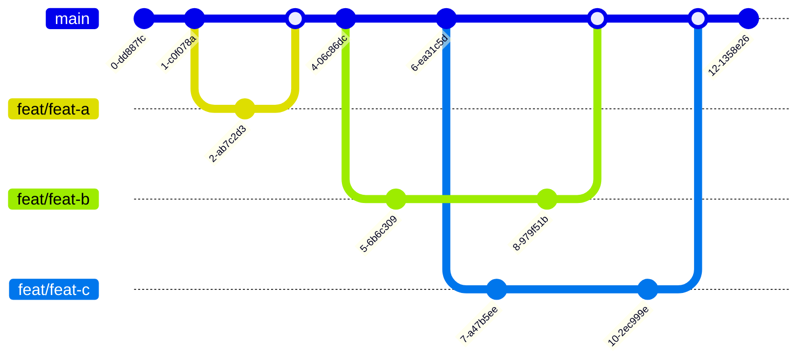

---
tags:
  - practices
  - practices_scm
title: Trunk-Based Development
layout: default.njk
---

## Principle

Trunk-based development is a version control management practice where developers merge small, frequent updates to a core “trunk” or main branch.

## Relationship with DevOps

Trunk-Based Development is relavant to DevOps because it focuses on enhancing continuous integration.

### Advantages

- Since it streamlines merging and integration phases, it helps achieve CI/CD and increases software delivery and organizational performance1.
- One key benefit of the trunk-based approach is that it reduces the complexity of merging events and keeps code current by having fewer development lines and by doing small and frequent merges.

### Disavantages

- It requires a high level of discipline and communication among team members to ensure that changes are properly integrated and tested before being merged into the main branch.
- It may not be the best choice for teams that are new to CI/CD practices or for projects with complex codebases that require more structured development processes.

## Related DevOps Articles

## Reference

https://trunkbaseddevelopment.com/
